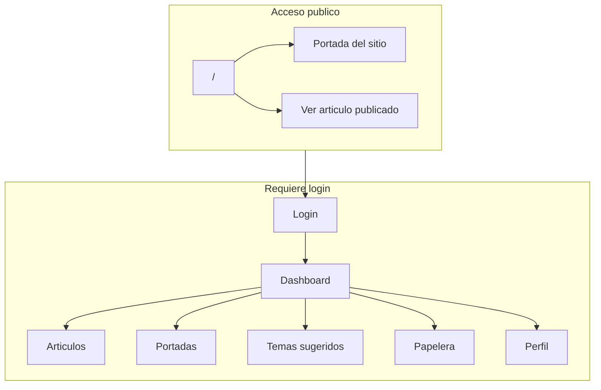
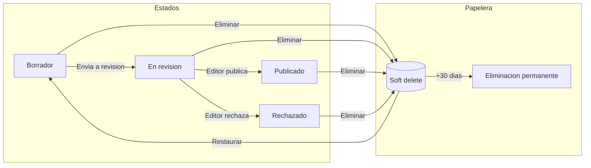
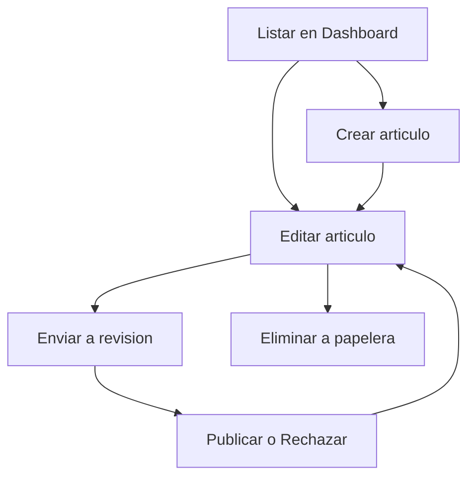
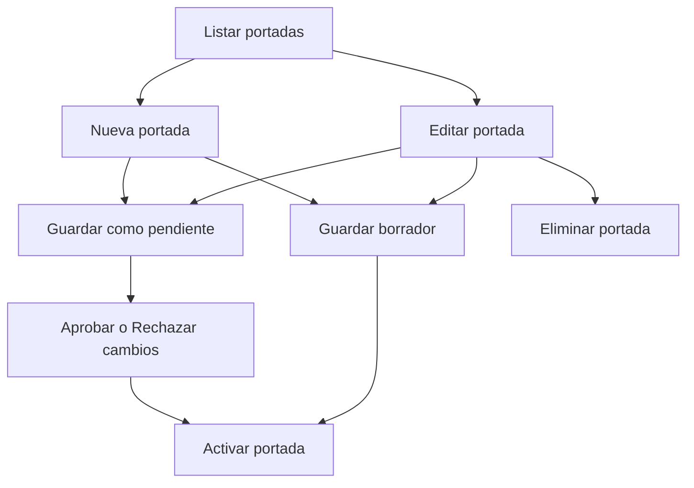
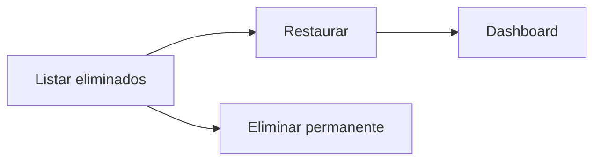
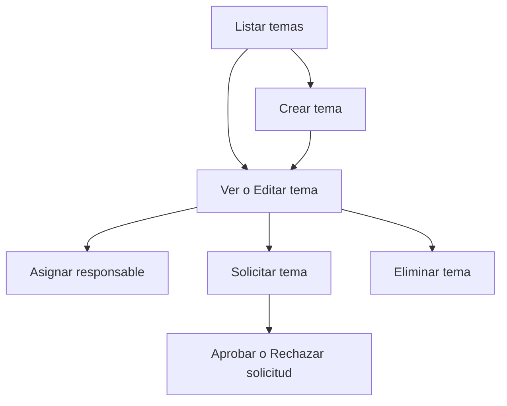
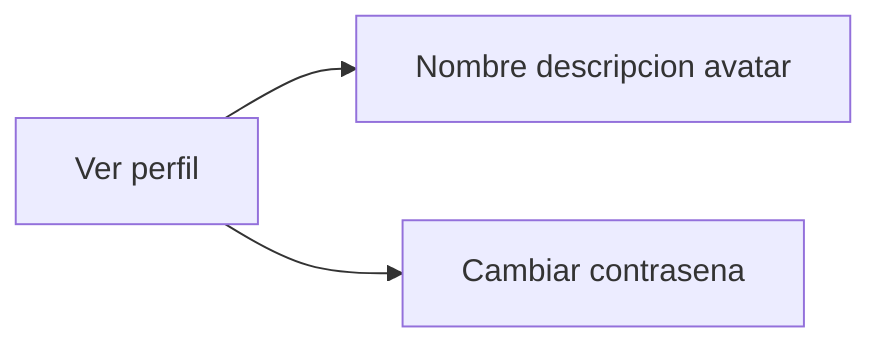

# Revista Mundo Real

Aplicación web para la gestión de una revista digital: artículos, portadas, temas sugeridos, roles y notificaciones por correo. Desarrollada con **Laravel 12** y **Livewire 3**.

---

## Resumen del proyecto

**Revista Mundo Real** es un panel de redacción que permite:

- **Crear y publicar artículos** con editor de bloques (texto, imágenes, galerías, reseñas), secciones, etiquetas y flujo de revisión (borrador → en revisión → publicado / rechazado).
- **Gestionar la portada** del sitio: crear versiones, activar una portada, y someter cambios pendientes que editores jefe/moderadores/administradores pueden aprobar o rechazar.
- **Gestionar temas sugeridos** para artículos: proponer temas, asignar responsables, solicitar un tema y aprobar/rechazar solicitudes.
- **Papelera de artículos**: eliminar artículos con soft delete, restaurarlos o borrarlos de forma permanente; los que llevan más de 30 días en papelera se purgan automáticamente.
- **Notificaciones por email** (portadas, temas sugeridos, artículos, perfil) enviadas en cola cuando está configurado el driver de cola.

El acceso es por **login**; la portada pública y la lectura de artículos publicados son visibles sin autenticación.

### Diagrama: flujo general de la aplicación



### Diagrama: flujo de estado de un artículo



### Flujos CRUD por módulo

Cada diagrama indica **permisos** en los nodos (quién puede hacer cada acción) y debajo se resume **qué se ve en la vista** y **quién puede qué**.

#### Artículos



| | |
|--|--|
| **Qué se ve** | **Dashboard**: el autor ve solo sus artículos; editor_chief, moderator y administrator ven todos. Botones Crear, Editar (por artículo) y Eliminar a papelera según permiso. En la vista de edición: Enviar a revisión (autor), Publicar/Rechazar (solo editores). |
| **Permisos** | Crear/Editar/Enviar a revisión: autor sobre sus artículos. Publicar, Rechazar, Eliminar a papelera: autor de ese artículo **o** editor_chief / moderator / administrator. |

#### Portadas



| | |
|--|--|
| **Qué se ve** | **Listado**: todas las portadas (activa, pendientes, borradores). Acceso a Nueva y Editar. En edición: Guardar, Guardar como pendiente; si hay pendiente, editores ven Aprobar/Rechazar. Activar y Eliminar según permiso (solo si no está activa/pendiente para eliminar). |
| **Permisos** | Crear, Editar, Guardar, Pendiente: cualquier usuario autenticado. **Activar** y **Aprobar/Rechazar**: solo editor_chief, moderator, administrator. **Eliminar**: creador de esa portada o quien pueda activar (y solo portada no activa y no pendiente). |

#### Papelera



| | |
|--|--|
| **Qué se ve** | **Papelera**: el autor ve solo sus artículos eliminados; editores ven todos. Por artículo: botón Restaurar y botón Eliminar permanentemente (con modal de confirmación). |
| **Permisos** | Restaurar y Eliminar permanente: autor de ese artículo **o** editor_chief, moderator, administrator. |

#### Temas sugeridos



| | |
|--|--|
| **Qué se ve** | **Listado**: todos los temas con estado (disponible, asignado, solicitado, etc.). Crear, Ver/Editar, Eliminar según permiso. En detalle/edición: Asignar (editores o asignado), Solicitar tema (usuarios), Aprobar/Rechazar solicitud (el asignado al tema). |
| **Permisos** | Crear, Ver/Editar: cualquiera autenticado (editar según sea creador, asignado o editor). **Asignar**: editor_chief, moderator, administrator (o asignado si está en estado taken/requested). **Solicitar**: cualquier usuario. **Aprobar/Rechazar solicitud**: el usuario asignado al tema. **Eliminar**: creador del tema **o** editor_chief, moderator, administrator. |

#### Perfil



| | |
|--|--|
| **Qué se ve** | **Perfil**: solo el usuario actual. Formulario con nombre, descripción, avatar y opción de cambiar contraseña. |
| **Permisos** | Solo el propio usuario puede ver y editar su perfil. |

---

## Stack técnico

| Tecnología        | Uso                                      |
|-------------------|------------------------------------------|
| **Laravel 12**    | Backend, rutas, modelos, migraciones    |
| **Livewire 3**    | Componentes interactivos sin escribir JS |
| **PHP 8.2+**      | Lenguaje del servidor                    |
| **Base de datos** | MySQL/PostgreSQL/SQLite (según `.env`)  |
| **Colas**         | Envío de correos (tabla `jobs`)         |
| **Scheduler**     | Purga diaria de papelera (>30 días)     |

---

## Roles y permisos

Los usuarios tienen un campo `rol` con los siguientes valores:

| Rol              | Descripción breve |
|------------------|--------------------|
| **editor_chief** | Editor jefe        |
| **moderator**    | Moderador          |
| **administrator**| Administrador      |
| (resto)           | Autor/colaborador  |

- **Artículos**: el autor ve y gestiona los suyos; `editor_chief`, `moderator` y `administrator` ven todos y pueden publicar, rechazar, eliminar a papelera y eliminar permanentemente en papelera.
- **Portadas**: cualquier usuario autenticado puede crear y editar; solo los tres roles anteriores pueden **activar** una portada y **aprobar o rechazar** cambios pendientes. Eliminar portada: creador o quien pueda activar.
- **Temas sugeridos**: crear, editar, asignar, solicitar y rechazar según permisos; eliminar: creador del tema o uno de los tres roles anteriores.

---

## Módulos principales

### Artículos

- Creación con editor de contenido por bloques (texto, imagen, galería, reseña), imagen principal, sección, etiquetas, resumen, meta.
- Estados: borrador, en revisión, publicado, rechazado.
- Envío a revisión → notificación a editores. Publicación o rechazo → notificación al autor.
- Eliminación a papelera (soft delete) con notificación al autor; desde papelera se puede restaurar o eliminar permanentemente (borrando también imágenes en disco).

### Portadas

- Listado de portadas; creación de nueva portada o edición de una existente.
- Una portada puede estar **activa** (la que se muestra en la web). Los cambios se pueden guardar como **versión pendiente** para que un editor los apruebe o rechace.
- Al crear/guardar una versión pendiente se notifica a editores. Al activar una portada se notifica al creador.
- Eliminación solo para portadas no activas y no pendientes; modal de confirmación.

### Temas sugeridos

- Listado, creación, detalle y edición de temas. Asignación de responsable; solicitud de tema por un usuario y aprobación/rechazo por el responsable.
- Notificaciones: tema asignado, solicitud recibida (al asignado), solicitud rechazada (al solicitante).
- Eliminación por creador o por editor_chief/moderator/administrator con modal de confirmación.

### Dashboard

- Acciones rápidas: crear artículo, temas sugeridos, portadas, papelera, estadísticas.
- Listado de artículos recientes del usuario (o de todos para editores) con opciones de editar y eliminar a papelera según permisos.

### Papelera

- Ruta: `dashboard/papelera`. Lista de artículos eliminados (soft delete): el autor ve los suyos; editores ven todos.
- Acciones: restaurar y eliminar permanentemente (con borrado de imágenes en almacenamiento).

### Perfil

- Edición de nombre, descripción, avatar y contraseña. Notificación por correo al cambiar contraseña (y opcionalmente al actualizar perfil).

---

## Notificaciones por email

Los correos usan el Mailable base `BaseNotificationMail` (layout común) y `SimpleMessageMail` para mensajes simples. Todos implementan **ShouldQueue**: se encolan si `QUEUE_CONNECTION` no es `sync`.

Resumen de envíos:

| Momento                         | Quién recibe                          |
|---------------------------------|----------------------------------------|
| Artículo enviado a revisión     | Editores (editor_chief, moderator, administrator) |
| Artículo publicado o rechazado  | Autor del artículo                    |
| Artículo movido a papelera      | Autor del artículo                    |
| Nueva versión pendiente portada | Editores                              |
| Portada activada                | Creador de la portada                 |
| Tema sugerido asignado          | Usuario asignado                      |
| Solicitud de tema               | Responsable del tema                  |
| Solicitud de tema rechazada     | Usuario que solicitó                  |
| Cambio de contraseña            | Usuario que la cambió                 |

---

## Colas y programación

### Cola de correos

- Con `QUEUE_CONNECTION=database` (o `redis`, etc.) los correos **no se envían al instante**: se guardan en la tabla `jobs` y quedan pendientes hasta que un **worker** los procese.
- Tablas: `jobs`, `job_batches`, `failed_jobs` (incluidas en las migraciones por defecto del proyecto).

**Para que los correos se envíen tienes dos opciones:**

1. **Usar cola (recomendado en producción):** tener en marcha un proceso que lea la tabla `jobs` y envíe los correos. Ejecuta en la raíz del proyecto:
   ```bash
   php artisan queue:work
   ```
   Este comando se queda corriendo: cada pocos segundos mira si hay jobs en la tabla y los ejecuta (envía el correo, y si falla lo reintenta según configuración). En el servidor suele dejarse con Supervisor o systemd para que no se caiga.

2. **Envío inmediato (sin worker):** si no quieres montar un worker, en el `.env` pon:
   ```env
   QUEUE_CONNECTION=sync
   ```
   Con `sync`, cada correo se envía en el mismo momento de la acción (no se usa la tabla `jobs`). La respuesta de la web puede tardar un poco más y no hay reintentos automáticos si falla el envío.

### Scheduler (papelera)

- Comando: `articles:purge-trash`. Elimina de forma permanente los artículos que llevan **más de 30 días** en papelera (y borra sus imágenes en disco).
- Programado en `routes/console.php`: `Schedule::command('articles:purge-trash')->daily();`
- Para que se ejecute en el servidor, hay que configurar un cron que ejecute cada minuto:  
  `php artisan schedule:run`

---

## Instalación

### Requisitos

- PHP 8.2 o superior  
- Composer  
- Node.js y npm (para compilar assets)  
- Base de datos (MySQL, PostgreSQL o SQLite)

### Pasos

```bash
# Clonar y entrar al proyecto
cd revista-mundo-real

# Dependencias PHP
composer install

# Variables de entorno
cp .env.example .env
php artisan key:generate

# Base de datos (ajustar DB_* en .env antes)
php artisan migrate

# Dependencias front y compilar
npm install
npm run build
```

### Variables de entorno relevantes

- `APP_*`: nombre, URL, entorno, debug.
- `DB_*`: conexión a la base de datos.
- `MAIL_*`: para el envío de correos (SMTP, etc.).
- `QUEUE_CONNECTION`: `sync` (envío inmediato) o `database`/`redis` (cola).
- `FILESYSTEM_DISK`: disco por defecto para imágenes (p. ej. `public`).

---

## Desarrollo

```bash
# Servidor, cola y Vite a la vez
composer dev

# O por separado:
php artisan serve
php artisan queue:work
npm run dev
```

- **Purga de papelera (manual):** `php artisan articles:purge-trash`
- **Listar tareas programadas:** `php artisan schedule:list`

---

## Checklist antes del deploy

- [ ] **Variables de entorno**: `APP_ENV=production`, `APP_DEBUG=false`, `APP_URL` con la URL real. `DB_*`, `MAIL_*` y `SESSION_*` configurados.
- [ ] **Clave**: `php artisan key:generate` (o `APP_KEY` ya definido en `.env`).
- [ ] **Migraciones**: `php artisan migrate --force` (producción).
- [ ] **Storage**: si se suben imágenes a `storage/app/public`, crear el enlace: `php artisan storage:link` (enlaza `public/storage` → `storage/app/public`).
- [ ] **Assets**: `npm ci && npm run build` para generar el manifest de Vite y los CSS/JS.
- [ ] **Cola**: worker en marcha (`php artisan queue:work`) si usas cola para correos.
- [ ] **Cron**: un cron que ejecute cada minuto `php artisan schedule:run` (purga de papelera y otras tareas).
- [ ] **Permisos**: directorios `storage` y `bootstrap/cache` escribibles por el servidor web.

---

## Producción

1. **Cola**: tener un worker ejecutando de forma continua, por ejemplo:  
   `php artisan queue:work --tries=3`  
   (o gestionado por Supervisor/systemd).
2. **Scheduler**: cron cada minuto que ejecute:  
   `php artisan schedule:run`  
   (en la ruta del proyecto).

---

## Estructura de código relevante

```
app/
├── Mail/
│   ├── BaseNotificationMail.php   # Base con ShouldQueue y layout común
│   └── SimpleMessageMail.php      # Correo título + cuerpo
├── Models/
│   ├── Article.php                 # SoftDeletes, secciones, contenido por bloques
│   ├── CoverArticle.php            # Portadas y versiones pendientes
│   ├── SuggestedTopic.php
│   └── User.php                    # rol (editor_chief, moderator, administrator)
├── Livewire/
│   ├── Dashboard.php, ArticleTrash.php
│   ├── CreateArticle.php, UpdateArticle.php, ShowArticle.php
│   ├── CoverList.php, EditCover.php, ManageCover.php
│   ├── SuggestedTopicList.php, ShowSuggestedTopic.php, EditSuggestedTopic.php
│   ├── Profile.php, Login.php
│   └── Hero, LatestArticles, MainArticles, NavBar, Footer, etc.
├── Notifications/
│   ├── ArticleNotificationService.php
│   ├── CoverNotificationService.php
│   ├── SuggestedTopicNotificationService.php
│   ├── ProfileNotificationService.php
│   └── AuthNotificationService.php
routes/
├── web.php      # Rutas públicas y protegidas (auth)
└── console.php  # Comando articles:purge-trash y Schedule
```

---

## Licencia

El framework Laravel es software open source bajo la [licencia MIT](https://opensource.org/licenses/MIT).
